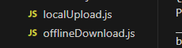
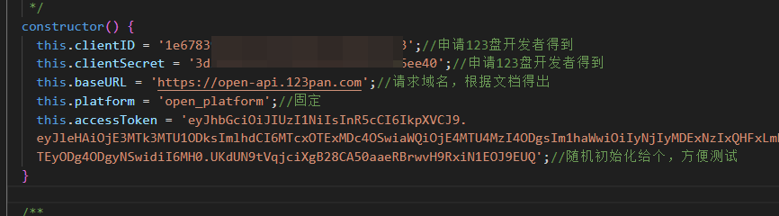
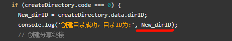
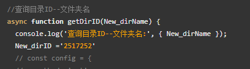
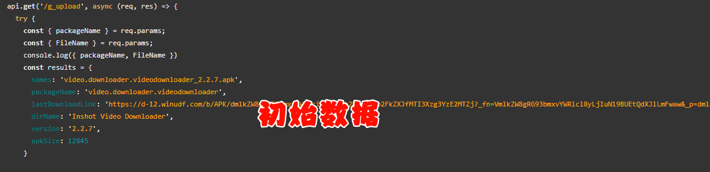

# 123pan-upload-example

#### 介绍
一个简单的123盘上传实例，通过简单的API封装，实现文件下载本地上传，文件离线上传

#### 使用说明

>1、npm install  下载基础依赖

>2、主要分析

>一个是本地逻辑

>一个是创建离线下载逻辑

请修改updown_apk\123Pan\function.js

>其中updown_apk/apk中的文件是模拟本地下载好的文件，使用本地上传localUpload.js方法，其中要注意，修改目录id，为新建的ID

>如果目录已经存在，可以查询，我这里简单演示，直接赋值上传的目的地目录ID，你需要修改

然后启动`nodemon app.js`

访问`http://127.0.0.1:9123/api/g_upload`

#### 其他关联

- 简单Python示例：
  - [https://gitee.com/lyd-code/123pan-upload-python-example](https://gitee.com/lyd-code/123pan-upload-python-example)
  - [https://gitee.com/wojiaoyishang/123pan](https://gitee.com/wojiaoyishang/123pan)

- 简单Node示例：
  - [https://gitee.com/zaidu_jj/123pan-upload-example](https://gitee.com/zaidu_jj/123pan-upload-example)

- 简单PHP示例：
  - [https://gitee.com/itcolss/123pan-upload-php-example](https://gitee.com/itcolss/123pan-upload-php-example)

- 简单Java示例：
  - [https://gitee.com/itcolss/123pan-upload-java-example](https://gitee.com/itcolss/123pan-upload-java-example)

>▶使用方式请参照123云盘开放平台官方文档：https://123yunpan.yuque.com/org-wiki-123yunpan-muaork/cr6ced?#

>▶123盘官方示例：https://gitee.com/pan123-git/123pan-link

#### 参与贡献

